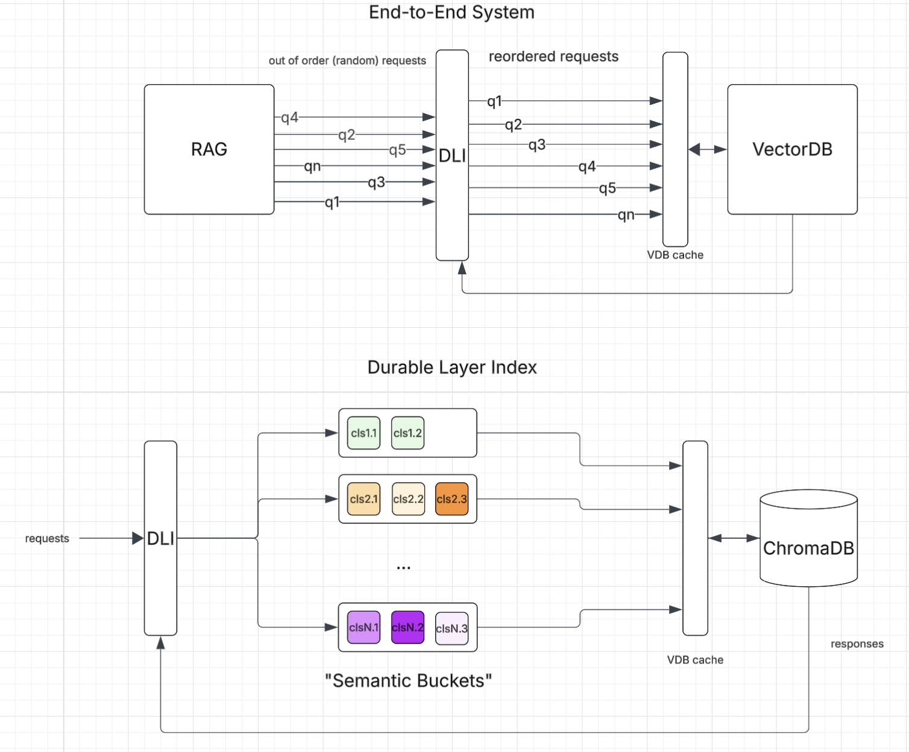

# DLI
Durable Layered Index for Agentic RAG Systems. DLI is an abstraction layer that reorders semantic requests in order to exploit a Vector database's cache locality when performing accesses. This is a solution to the I/O Mismatch Problem, which arises due to using Cloud Storage solutions over traditional, highly-coupled VectorDB compute/storage infrastructure. To promote the adoption of Cloud infrastructure for VDB's within agentic workflows, we propose the DLI.

GoLang implementation for https://github.com/tkhdse/Durable-Layer-Index

